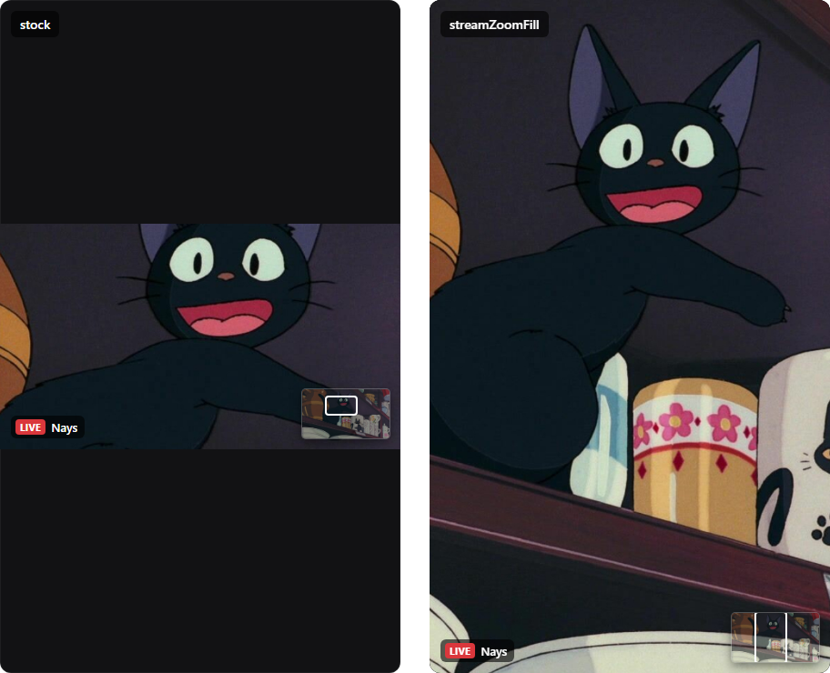

# streamZoomFill

zoom into a stream and it actually fills your screen instead of being locked inside a 16:9 box

## why

in discord, when zooming in on a stream, you are limited by the box shape of that stream. in vertical displays and narrow windows, you'll have big black bars even at high zoom levels

## what it does

- past 100%, the stream fills the entire video element
- you can't drag it out of the screen while panning
- the minimap still works
- at 100% it doesn't do anything

## install

if you made it here you probably already know how to install custom plugins, but if not just check [vencord's guide](https://docs.vencord.dev/installing/custom-plugins/)
